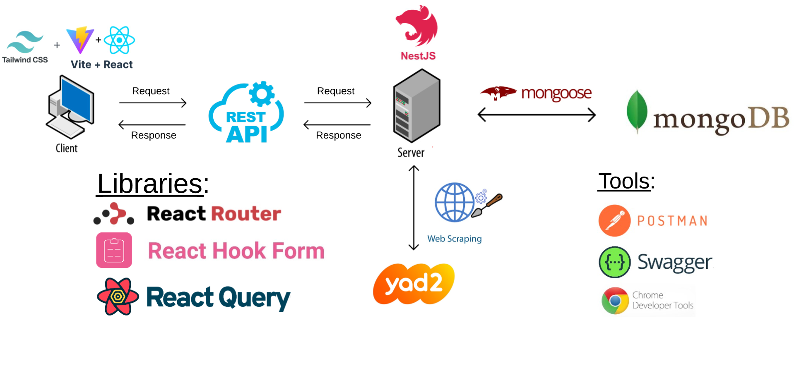

    <h1>Real Estate Smart Agent App</h1>
    <h3>
        <a href="#" color="white">
        Live
        </a>
         | 
        <a href="#">
        Video
        </a>
    </h3>

    A smart agent app that helps you find your dream home

## 🧐 Introduction 

A full-stack web application that allow users to search for various types of houses and apartments across Israel with starightforward and easy to use interface, without ads or any other distractions, and without having to refresh the page to get updated results. The data comes from the well known Israeli [Yad2](https://www.yad2.co.il/) website, and aims to provide a better user experience. Users can search estates for either rent or purchase, and filter the results by price and date. The app also highlights new and updated results for the user's convenience. Each result contains a link to the original post on Yad2, so the user can read more details about the estate and contact the seller directly.

## 🏛️ Architecture

## ⛏️ Built Using 

<table>
    <thead>
        <tr>
            <th>Property</th>
            <th>Badges</th>
        </tr>
    </thead>
    <tbody>
        <tr>
            <td> 🎨 Design</td>
            <td>
                
            </td>
        </tr>
        <tr>
            <td>📋 Languages & Tools</td>
            <td>
                
                
            </td>
        </tr>
        <tr>
            <td>📚 Libraries</td>
            <td>
                
                
                
                
                
        </tr>
        <tr>
            <td>🚀 Frameworks</td>
            <td>
                
                
                
            </td>
        </tr>
        <tr>
            <td>🗄️ Database</td>
            <td>
                
                
        </tr>
        <tr>
        <td>🧪 Testing</td>
            <td>
                
                
                
            </td>
        </tr>
        <tr>
        <td>☁️ Hosting</td>
            <td>
                
                
            </td>
        </tr>
        <tr>
            <td>🥅 Other</td>
            <td>
                
                
                
                
            </td>
    </tbody>
</table>

## 🎈 Features 

- [x] Search for estates for rent or purchase
- [x] Use url query params to search for estates
- [x] Filter results by price and date
- [x] Highlight new and updated results
- [x] Redirect to original post on Yad2
- [x] Responsive design

## 💡 Useful Resources 

- [Yad2](https://www.yad2.co.il/) - A well known Israeli website for publishing ads for various types of estates, cars, and more.
- [React Flip Move](https://joshwcomeau.github.io/react-flip-move/) - A React component for animating lists when their order changes or when items are added or removed.
- [React Lottie](https://www.npmjs.com/package/react-lottie) - A React component for rendering Lottie animations.

## 🙏 Acknowledgements 

- [Font Awesome](https://fontawesome.com/) - for providing the icons used in this project.
- [IconScout](https://iconscout.com/) - for providing the favicon, SVG illustrations, and Lottie animations used in this project.
